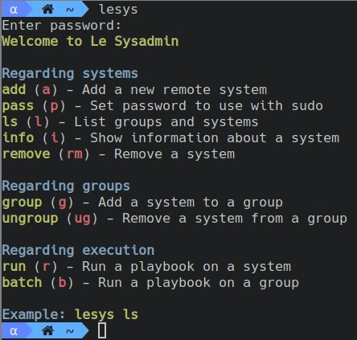
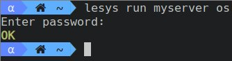
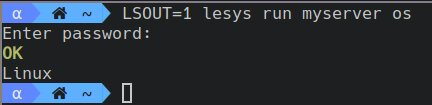

# Le Sysadmin

## Introduction
Le Sysadmin is a collection of POSIX shell scripts to manage a large amount of servers.

Think of Le Sysadmin like a suckless Ansible. You run _playbooks_ on a server or a group of them. These _playbooks_ can include others in order to provide a platform-independent environment.

Le Sysadmin has zero overhead on the server, since everything is executed via regular SSH.

## Quick start
Clone the repository and add it to `$PATH` so it can be executed. Something like:
```sh
git clone https://github.com/jlxip/lesysadmin /opt/lesysadmin
echo 'PATH=/opt/lesysadmin:$PATH' >> ~/.bashrc
```

Once you have it in place, call Le Sysadmin with `lesys`.

Le Sysadmin is meant to manage multiple servers via SSH. Their connection info is stored in a database, an encrypted JSON file, by default in `~/.lesysadmin` (other place can be specified via `LESYSADMIN` env var). The first time you run `lesys`, a password will be requested. This will be the one used in following commands. The database contains SSH keys as well as the passwords used in `sudo`, so pick a strong one.

When running only `lesys`, the program will enumerate all possible actions.



All commands have a shortcut name in order to type them more quickly. `lesys ungroup` is the same as `lesys ug`.

You should then add a remote system; that is, a server. Use `lesys add`, in the lines of:
```sh
lesys add myserver myserver.example.com 22 user ~/.ssh/id_rsa
```

You might now want to set `user`'s password, in case at some point you need to run something as root:
```sh
lesys pass myserver
```

You're all set. When you have a few more servers, you can put them in groups, and execute actions in all of them. A system can be groupless or belong to multiple groups.
```sh
lesys group myserver mygroup
lesys group myotherserver mygroup
lesys ls # Will say that both systems are part of "mygroup"
```

You're ready to execute your first playbook. A list of [given playbooks](#given-playbooks) is available in this README. Let's try `os`, which prints the OS name (`Linux`, `OpenBSD`, ...). Run:
```sh
lesys run myserver os
```



Playbooks have both a return value (`OK`, in this case) and, sometimes, print to stdout. However, Le Sysadmin ignores all output, since playbooks are not meant to give information, but perform actions. `os` did print the OS, but for other playbooks to use. You can force Le Sysadmin to show stdout by setting the `LSOUT` env var
```sh
LSOUT=1 lesys run myserver os
```



When debugging, you can set the `DEBUG` env var to view the commands being sent. If contributing to the project, you can set the `DUMP` env var to view the unencrypted json. Careful: both will output sensitive data.

Playbooks are found in the `playbook` subdirectory of wherever you installed Le Sysadmin. If they're not found, `~/.playbooks/` will be checked.

## Writing playbooks
Playbooks are simple POSIX shell scripts. They have three parts:

- The `INCLUDE` variable, which can be empty, but must be set. It specifies other playbooks to _include_, in case you want to execute them from yours.
- A function definition, which will be executed on the server. It's convention to use `playbookname_execute()`, but it can be whatever you want.
- The `EXECUTE` variable, which contains the name for the function mentioned above.

The execute function must `return` a value. If no `return` is specified, it will return 0 (shell rules), which is the same as `EXIT_OK`. The following return values are defined:
- `EXIT_OK`, `0`. Everything went fine.
- `EXIT_SKIP`, `130`. The playbook skipped execution because it was not necessary. A playbook might want to return this value, for instance, if its purpose is to install a package, and it's already installed. `EXIT_SKIP` has the same implications as `EXIT_OK`: it's not an error.
- `EXIT_INCOMPATIBLE`, `131`. The playbook cannot be executed on the specified server. Playbook writers should try to be OS-independent, but if the OS isn't supported in it, it should return this value. For instance, `distro` returns `EXIT_INCOMPATIBLE` if it's ran on a non-Linux server.
- Any other value will be treated as an unexpected error, and its output will be written to stdout (as if `LSOUT` was set). I'd suggest using `99`.

Now that you know this, you can look at the trivial example of [`os`](https://github.com/jlxip/lesysadmin/blob/master/playbooks/os), and also [`distro`](https://github.com/jlxip/lesysadmin/blob/master/playbooks/distro), which is the simplest that uses `INCLUDE`. Then, you can have a look at [`install`](https://github.com/jlxip/lesysadmin/blob/master/playbooks/install) too, which is non-trivial.

`set -e` is set on all playbooks, which stops execution if anything returns non-zero. This is generally good practice since the playbook will not enter undefined behavior. `set +e` can disable it, but please be very careful. If you decide to disable it, the exported function `assert_last_ok` will check if exit in case `$?` is anything other than `EXIT_OK` or `EXIT_SKIP`. `set -u` is on as well.

## Given playbooks
Under `playbooks/` in this repository, there are some default playbooks that might be useful for the general use case.

| Name    | Function          | Arguments                | Description                                                                                                              |
|---------|-------------------|--------------------------|--------------------------------------------------------------------------------------------------------------------------|
| os      | `os_execute`      |                          | Prints the operating system                                                                                              |
| distro  | `distro_execute`  |                          | Prints the Linux distribution, as specified in /etc/os-release                                                           |
| sudo    | `sudo_execute`    | <command>                | Executes a command as superuser, using the password given with `lesys p`. In environment with no `sudo`, it uses `doas`. |
| install | `install_execute` | <package name>           | Installs a package. Returns `EXIT_SKIP` if already installed.                                                            |
| init    | `init_execute`    | <action> <service>       | OS-independent way of `start`, `stop`, `enable`, and `disable` services                                                  |
| cron    | `cron_execute`    | <add/del> <user> <order> | For adding cronjobs. If already added (or already removed), returns `EXIT_SKIP`                                          |

You can check [my playbooks](https://github.com/jlxip/dotfiles/tree/master/playbooks) as well, which are more realistic and useful.

## Additional information
- Le Sysadmin follows [Semantic Versioning 2.0.0](https://semver.org/spec/v2.0.0.html).
